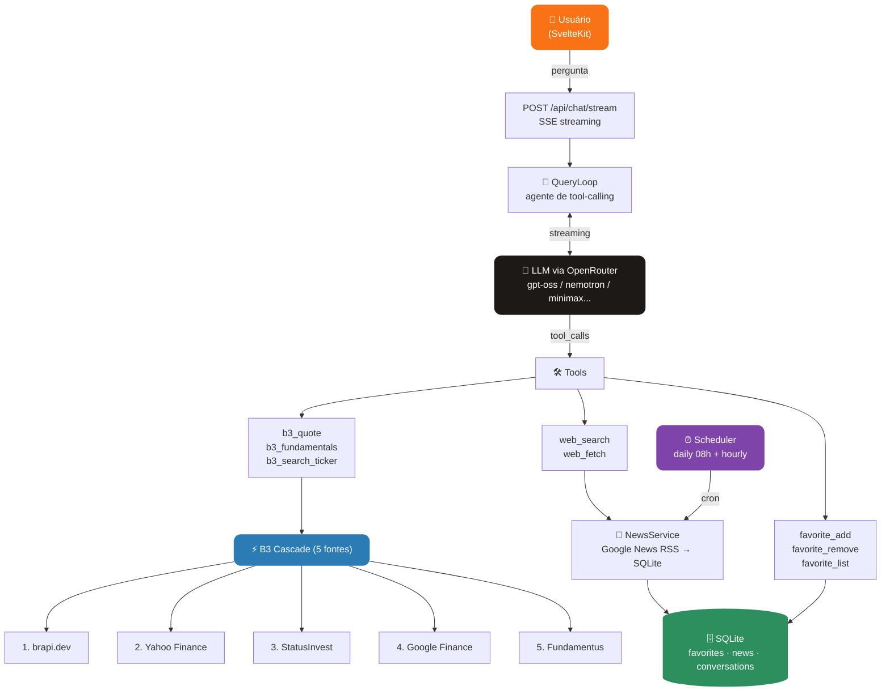

<div align="center">


# Genie

**Assistente financeiro de B3 com IA — cotações, fundamentos, notícias e chat em tempo real.**

[](https://github.com/JohnPitter/genie/actions/workflows/ci.yml)
[](https://typescriptlang.org)
[](https://kit.svelte.dev)
[](https://fastify.dev)
[](https://sqlite.org)
[](https://vitest.dev)
[](#license)

[Features](#features) · [Como Funciona](#como-funciona) · [Tech Stack](#tech-stack) · [Desenvolvimento](#desenvolvimento) · [Variáveis de Ambiente](#variáveis-de-ambiente)

</div>

---

## O que é o Genie?

Genie é um assistente financeiro especializado na B3 (bolsa de valores brasileira). Ele combina dados de mercado em tempo real com um agente de IA que responde perguntas, busca notícias, analisa fundamentos e gerencia sua lista de ativos favoritos — tudo via chat com streaming.

**Stack 100% TypeScript** — monorepo pnpm com Fastify no backend e SvelteKit no frontend, SQLite como banco embutido, sem infraestrutura externa obrigatória.

---

## Features

| Categoria | O que você ganha |
|---|---|
| **Chat com IA** | Agente em português brasileiro com streaming SSE — responde perguntas sobre qualquer ativo da B3 |
| **Retry automático** | Botão de retry em respostas com erro; o agente sempre retorna algo mesmo sem dados completos |
| **Cotações em tempo real** | Preço, variação %, volume e market cap via cascade de 5 fontes com circuit breaker automático |
| **Fundamentos** | P/L, P/VP, Dividend Yield, ROE, Dív/Patrim., Margem Líquida |
| **Busca de tickers** | Busca por prefixo em +150 ativos catalogados em 7 setores |
| **Notícias filtradas** | Google News RSS por ticker/categoria com cache SQLite e filtro anti-ruído |
| **Rankings** | Top 5 ativos mais citados nas notícias por setor, com cotação em tempo real |
| **Favoritos** | Adicione/remova ativos — o agente usa sua carteira como contexto nas respostas |
| **Circuit breaker** | Cascade de 5 fontes com fallback automático — nenhum ativo da B3 fica sem cotação |
| **Fallback de modelo** | Múltiplos modelos LLM em cascata via `OPENROUTER_MODEL_FALLBACK` — se o primário falhar, o próximo entra |
| **Timing por step** | Logs de TTFT, duração LLM e tools por step de raciocínio — identify gargalos facilmente |
| **Mobile-first** | Layout responsivo para iPhone SE/12/14 Pro Max — sidebar vira drawer, chat vira overlay |
| **Jobs agendados** | Refresh diário de notícias dos favoritos e warmup de cache de cotações |
| **Painel Admin** | `/settings` protegido por token, com status do sistema e disparo manual de jobs |
| **CI/CD** | GitHub Actions com type-check, testes e build em cada PR — `main` protegida |
| **644 testes** | 207 API (unitários + integração + e2e parity) + 437 Web — todos passando |

---

## Como Funciona



### Cascade de 5 Fontes B3

Cada request percorre as fontes em ordem. Se uma falha ou o circuit breaker abriu, a próxima é tentada automaticamente:

| # | Fonte | Tipo | Cobertura |
|---|---|---|---|
| 1 | **brapi.dev** | API | Principais ativos, dados ricos |
| 2 | **Yahoo Finance** | API | Ampla cobertura, fundamentos completos |
| 3 | **StatusInvest** | Scraper | B3 nativa, todos os setores |
| 4 | **Google Finance** | Scraper | Ampla cobertura global |
| 5 | **Fundamentus** | Scraper | Small/mid caps que as outras perdem |

### Agente de Tool-Calling

O `QueryLoop` executa até 20 passos de raciocínio com contexto inteligente:

- **Favoritos injetados automaticamente** na primeira mensagem — o agente sabe sua carteira
- **Notícias visíveis no painel** passadas como contexto — o agente já leu o que você está vendo
- **Notícias do ativo** injetadas no chat da página do ativo — respostas mais relevantes
- **Retry em falhas** — botão de retry remove a resposta falha e reenvia; o agente sempre entrega algo mesmo sem dados completos
- **Timing por step** nos logs — `ttftMs`, `llmMs`, `toolsMs` por cada round-trip de raciocínio

### Fallback de Modelo

Defina `OPENROUTER_MODEL_FALLBACK` como lista separada por vírgula. O OpenRouter tenta cada modelo em ordem se o anterior falhar (429/5xx):

```
OPENROUTER_MODEL=openai/gpt-oss-120b:free
OPENROUTER_MODEL_FALLBACK=openai/gpt-oss-20b:free,nvidia/nemotron-3-nano-30b-a3b:free
```

> **Limite do OpenRouter:** máximo de 3 modelos por request (primário + 2 fallbacks). Modelos extras são ignorados.

### Painel Admin

Em `/settings` você acessa com o `ADMIN_TOKEN` do `.env` para:
- Ver status do sistema (API, DB, modelo LLM, versão)
- Consultar as variáveis de ambiente em uso
- Disparar manualmente o job de refresh de favoritos

---

## Tech Stack

| Camada | Tecnologia |
|---|---|
| **Frontend** | SvelteKit 2 + TypeScript + CSS custom properties (Orb Quantum Design System) |
| **Backend** | Node 22 + Fastify 5 + TypeScript |
| **Banco** | SQLite via better-sqlite3 (WAL mode) |
| **LLM** | OpenRouter — cascade de modelos via `models: []`, suporte nativo a fallback |
| **B3 Sources** | brapi.dev · Yahoo Finance · StatusInvest · Google Finance · Fundamentus |
| **Notícias** | Google News RSS (por ticker e categoria) + SQLite cache + filtro anti-ruído |
| **Web Fetch** | @mozilla/readability + turndown (HTML → Markdown) |
| **Web Search** | DuckDuckGo HTML (ferramenta de agente) |
| **Jobs** | croner |
| **Testes** | Vitest — 207 testes API + 437 testes Web |
| **CI** | GitHub Actions (type-check + tests + build) |
| **Package manager** | pnpm workspaces |

---

## Desenvolvimento

### Pré-requisitos

- Node.js 22+
- pnpm 10+
- Conta no [OpenRouter](https://openrouter.ai) (gratuita — modelos `:free` disponíveis)

### Setup

```bash
# Clone
git clone https://github.com/JohnPitter/genie.git
cd genie

# Instale dependências
pnpm install

# Configure o ambiente
cp apps/api/.env.example apps/api/.env
# Edite apps/api/.env e preencha pelo menos OPENROUTER_API_KEY
```

### Rodar em desenvolvimento

```bash
# Backend (porta 5858)
pnpm api:dev

# Frontend (porta 5173 — em outro terminal)
pnpm web:dev
```

O frontend faz proxy automático de `/api` para `localhost:5858`.

### Popular o banco com notícias iniciais

Na primeira execução o banco estará vazio. Rode o seeder para popular com artigos reais via Google News — já filtra páginas estáticas, YouTube e conteúdo irrelevante:

```bash
cd apps/api && node_modules/.bin/tsx src/scripts/seed-news.ts
```

### Benchmark de modelos

Para escolher qual modelo free usar ou atualizar o ranking (disponibilidade muda com o tempo):

```bash
cd apps/api && node_modules/.bin/tsx src/scripts/bench-models.ts
```

Mede TTFT, duração total e suporte a tool calling de cada modelo no contexto real do Genie.

### Testes

```bash
# Backend (207 testes)
pnpm api:test

# Frontend (437 testes)
pnpm web:test

# Workspace inteiro
pnpm test
```

---

## Estrutura do Monorepo

```
genie/
├─ apps/
│  ├─ api/                    # Backend TypeScript (Fastify + SQLite)
│  │  ├─ src/
│  │  │  ├─ agent/            # QueryLoop, Registry, OpenRouterClient, prompts
│  │  │  ├─ b3/               # Cascade + 5 fontes (brapi, yfinance, statusinvest, googlefinance, fundamentus)
│  │  │  ├─ jobs/             # Scheduler, DailyFavoritesJob, NewsRefreshJob
│  │  │  ├─ news/             # NewsService (Google News RSS + SQLite cache)
│  │  │  ├─ scripts/          # seed-news.ts · bench-models.ts
│  │  │  ├─ server/           # Fastify app + rotas (b3, news, favorites, chat, admin)
│  │  │  ├─ store/            # SQLite repos (conversations, favorites, news)
│  │  │  ├─ tools/            # b3_quote, b3_fundamentals, web_search, web_fetch, favorites
│  │  │  └─ main.ts           # Bootstrap completo
│  │  └─ tests/               # 207 testes (unit + integration + e2e parity)
│  └─ web/                    # Frontend SvelteKit (Orb Quantum Design System)
├─ .github/workflows/ci.yml   # CI: type-check + testes + build para API e Web
├─ packages/
│  └─ shared/                 # Tipos compartilhados (Article, Quote, Fundamentals, StreamEvent…)
├─ tsconfig.base.json
└─ pnpm-workspace.yaml
```

---

## Variáveis de Ambiente

Copie `apps/api/.env.example` para `apps/api/.env`:

| Variável | Obrigatória | Descrição |
|---|---|---|
| `OPENROUTER_API_KEY` | ✅ | Chave da API do OpenRouter |
| `OPENROUTER_MODEL` | — | Modelo primário (default: `openai/gpt-oss-120b:free`) |
| `OPENROUTER_MODEL_FALLBACK` | — | Lista CSV de fallbacks — OpenRouter tenta em ordem se o primário falhar |
| `ADMIN_TOKEN` | — | Token que libera o painel `/settings` e rotas `/api/admin/*` |
| `PORT` | — | Porta do servidor (default: `5858`) |
| `DB_PATH` | — | Caminho do SQLite (default: `genie.db`) |
| `LOG_LEVEL` | — | Nível de log pino (default: `info`) |
| `NODE_ENV` | — | `development` \| `production` |

### Modelos gratuitos recomendados

Resultado do benchmark (`bench-models.ts`) rodado no contexto real do Genie — mede TTFT e suporte a tool calling:

| Pos | Modelo | TTFT médio | Status |
|---|---|---|---|
| 🥇 | `openai/gpt-oss-120b:free` | ~2.0s | ✅ recomendado como primário |
| 🥈 | `openai/gpt-oss-20b:free` | ~1.7s | ✅ bom fallback rápido |
| 🥉 | `nvidia/nemotron-3-nano-30b-a3b:free` | ~1.8s | ✅ alternativa estável |
| 4º | `minimax/minimax-m2.5:free` | ~2.5s | ✅ backup confiável |
| ⚠️ | `nvidia/nemotron-3-super-120b-a12b:free` | ~18s | Funciona, mas lento |
| ❌ | `qwen/qwen3-next-80b-a3b-instruct:free` | — | Rate-limit frequente |
| ❌ | `google/gemma-3-27b-it:free` | — | Sem suporte a tool use |

> Os modelos `:free` mudam de disponibilidade com o tempo. Rode o benchmark periodicamente para atualizar o ranking.

---

## License

MIT License — use livremente.
