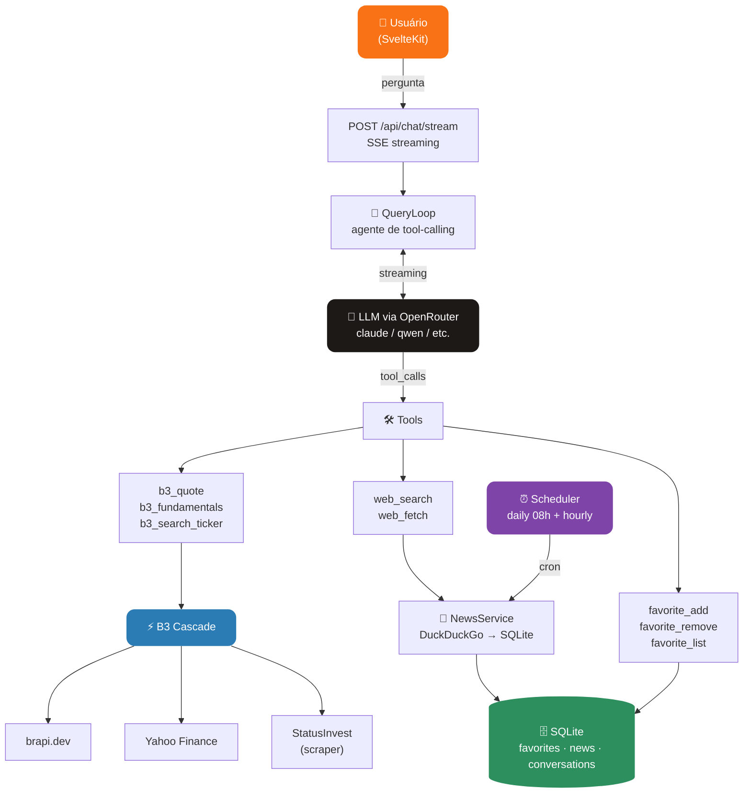

<div align="center">

# Genie

**Assistente financeiro de B3 com IA — cotações, fundamentos, notícias e chat em tempo real.**

[](https://typescriptlang.org)
[](https://kit.svelte.dev)
[](https://fastify.dev)
[](https://sqlite.org)
[](https://vitest.dev)
[](#license)

[Features](#-features) · [Como Funciona](#-como-funciona) · [Tech Stack](#-tech-stack) · [Desenvolvimento](#-desenvolvimento)

</div>

---

## O que é o Genie?

Genie é um assistente financeiro especializado na B3 (bolsa de valores brasileira). Ele combina dados de mercado em tempo real com um agente de IA que responde perguntas, busca notícias, analisa fundamentos e gerencia sua lista de ativos favoritos — tudo via chat com streaming.

**Stack 100% TypeScript** — monorepo pnpm com Fastify no backend e SvelteKit no frontend, SQLite como banco embutido, sem infraestrutura externa obrigatória.

---

## Features

| Categoria | O que você ganha |
|---|---|
| **Chat com IA** | Agente em português brasileiro com streaming SSE — responde perguntas sobre qualquer ativo da B3 |
| **Cotações em tempo real** | Preço, variação %, volume e market cap via cascade de fontes (brapi → Yahoo Finance → StatusInvest) |
| **Fundamentos** | P/L, P/VP, Dividend Yield, ROE, Dív/Patrim., Margem Líquida |
| **Busca de tickers** | Busca por prefixo em +150 ativos catalogados em 7 setores |
| **Notícias** | Busca web automática por ticker/categoria com cache em SQLite |
| **Favoritos** | Adicione/remova ativos, veja cotação + notícias mais recentes em uma tela só |
| **Circuit breaker** | Fallback automático entre fontes de dados; fonte indisponível não derruba a resposta |
| **Jobs agendados** | Refresh diário de notícias dos favoritos e warmup de cache de cotações |
| **207 testes** | Unitários, integração, e2e de paridade — todos passando |

---

## Como Funciona



### Agente de Tool-Calling

O `QueryLoop` executa até 20 passos de raciocínio:

1. Envia mensagens + ferramentas disponíveis para o LLM
2. Recebe deltas via SSE e encaminha tokens para o cliente em tempo real
3. Quando o LLM pede uma tool call, executa (em paralelo quando seguro)
4. Appende resultado ao histórico e repete
5. Ao receber resposta final, persiste a conversa no SQLite

### Cascade de Fontes B3

Cada request de cotação percorre as fontes em ordem de prioridade. Se uma falha ou o circuit breaker estiver aberto, a próxima é tentada automaticamente. Cache de 5 min para cotações, 24h para fundamentos.

---

## Tech Stack

| Camada | Tecnologia |
|---|---|
| **Frontend** | SvelteKit 2 + TypeScript + Tailwind CSS |
| **Backend** | Node 22 + Fastify 5 + TypeScript |
| **Banco** | SQLite via better-sqlite3 (WAL mode) |
| **LLM** | OpenRouter (compatível com qualquer modelo OpenAI-format) |
| **B3 Sources** | brapi.dev · Yahoo Finance · StatusInvest (scraper) |
| **Web Search** | DuckDuckGo HTML (sem API key) |
| **Web Fetch** | @mozilla/readability + turndown (HTML → Markdown) |
| **Jobs** | croner (cron scheduler) |
| **Testes** | Vitest (207 testes) |
| **Package manager** | pnpm workspaces |

---

## Desenvolvimento

### Pré-requisitos

- Node.js 22+
- pnpm 10+
- Conta no [OpenRouter](https://openrouter.ai) (gratuita — modelos free disponíveis)

### Setup

```bash
# Clone
git clone https://github.com/JohnPitter/genie.git
cd genie

# Instale dependências
pnpm install

# Configure o ambiente
cp apps/api/.env.example apps/api/.env
# Edite apps/api/.env e preencha OPENROUTER_API_KEY
```

### Rodar em desenvolvimento

```bash
# Backend (porta 5858)
pnpm api:dev

# Frontend (porta 5173 ou 5174 — em outro terminal)
pnpm web:dev
```

O frontend já está configurado para fazer proxy das chamadas `/api` para `localhost:5858`.

### Testes

```bash
# Todos os testes do backend (207 testes)
pnpm api:test

# Todos os testes do frontend
pnpm web:test

# Workspace inteiro
pnpm test
```

### Build de produção

```bash
pnpm build
```

---

## Estrutura do Monorepo

```
genie/
├─ apps/
│  ├─ api/                    # Backend TypeScript (Fastify + SQLite)
│  │  ├─ src/
│  │  │  ├─ agent/            # QueryLoop, Registry, OpenRouterClient, prompts
│  │  │  ├─ b3/               # Cascade, sources (brapi/yfinance/statusinvest), cache, breaker
│  │  │  ├─ jobs/             # Scheduler, DailyFavoritesJob, NewsRefreshJob
│  │  │  ├─ news/             # NewsService (search + SQLite cache)
│  │  │  ├─ server/           # Fastify app + rotas (b3, news, favorites, chat)
│  │  │  ├─ store/            # SQLite repos (conversations, favorites, news)
│  │  │  ├─ tools/            # b3_quote, b3_fundamentals, web_search, web_fetch, favorites
│  │  │  └─ main.ts           # Bootstrap completo
│  │  └─ tests/               # 207 testes (unit + integration + e2e parity)
│  └─ web/                    # Frontend SvelteKit
├─ packages/
│  └─ shared/                 # Tipos compartilhados (Article, Quote, Fundamentals, StreamEvent…)
├─ tsconfig.base.json
└─ pnpm-workspace.yaml
```

---

## Variáveis de Ambiente

Copie `apps/api/.env.example` para `apps/api/.env`:

| Variável | Obrigatória | Descrição |
|---|---|---|
| `OPENROUTER_API_KEY` | ✅ | Chave da API do OpenRouter |
| `OPENROUTER_MODEL` | — | Modelo padrão (default: `anthropic/claude-3.5-haiku`) |
| `PORT` | — | Porta do servidor (default: `5858`) |
| `DB_PATH` | — | Caminho do SQLite (default: `genie.db`) |
| `LOG_LEVEL` | — | Nível de log pino (default: `info`) |
| `NODE_ENV` | — | `development` \| `production` |

---

## License

MIT License — use livremente.
