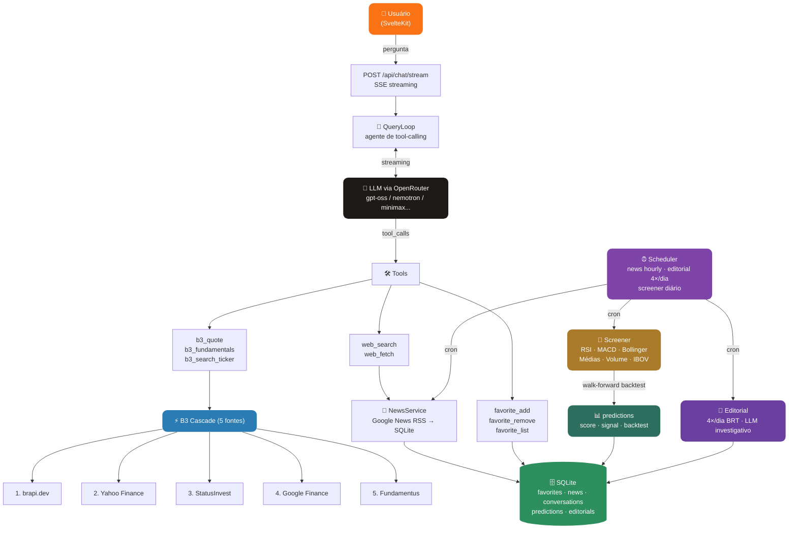

<div align="center">


# Genie

**Assistente financeiro de B3 com IA — cotações, fundamentos, notícias, predições e editorial diário.**

[](https://github.com/JohnPitter/genie/actions/workflows/ci.yml)
[](https://typescriptlang.org)
[](https://kit.svelte.dev)
[](https://fastify.dev)
[](https://sqlite.org)
[](https://vitest.dev)
[](#license)

[Features](#features) · [Como Funciona](#como-funciona) · [Tech Stack](#tech-stack) · [Desenvolvimento](#desenvolvimento) · [Variáveis de Ambiente](#variáveis-de-ambiente)

</div>

---

## O que é o Genie?

Genie é um assistente financeiro especializado na B3 (bolsa de valores brasileira). Ele combina dados de mercado em tempo real com um agente de IA que responde perguntas, busca notícias, analisa fundamentos e gerencia sua lista de ativos favoritos — tudo via chat com streaming.

Além do chat, o Genie publica um **editorial financeiro diário** gerado por IA (4 edições: 08h, 12h, 16h e 20h BRT) com análise investigativa por setor, cotações em tempo real e archive navegável de edições anteriores.

**Stack 100% TypeScript** — monorepo pnpm com Fastify no backend e SvelteKit no frontend, SQLite como banco embutido, sem infraestrutura externa obrigatória.

---

## Features

| Categoria | O que você ganha |
|---|---|
| **Chat com IA** | Agente em português brasileiro com streaming SSE — responde perguntas sobre qualquer ativo da B3 |
| **Cotações em tempo real** | Preço, variação %, volume e market cap via cascade de 5 fontes com circuit breaker automático |
| **Fundamentos** | P/L, P/VP, Dividend Yield, ROE, Dív/Patrim., Margem Líquida (FIIs detectados automaticamente e excluídos do scrape desnecessário) |
| **Predições de IA** | Score quantitativo -6 a +6 baseado em RSI, MACD, Bollinger, Médias Móveis, Volume e contexto IBOV — página `/predicoes` com top compras/vendas |
| **Backtest walk-forward** | Acurácia histórica de 60 dias por ticker — cada sinal mostra quantos % acertou D+5 no passado |
| **Editorial diário** | 4 edições/dia (08h · 12h · 16h · 20h BRT) geradas por IA: lead síntese, seções investigativas por setor, cotações em tempo real dos tickers em destaque e archive navegável |
| **Sentimento por setor** | Termômetro ↑ Alta / ↓ Baixa / → Lateral derivado das cotações reais dos tickers de cada seção editorial |
| **Notícias filtradas** | Google News RSS por ticker e categoria com cache SQLite e queries enriquecidas com nome da empresa |
| **Rankings** | Top 5 ativos mais citados nas notícias por setor, com cotação e link direto para análise |
| **Busca de tickers** | Busca por prefixo em +150 ativos catalogados em 7 setores |
| **Favoritos** | Adicione/remova ativos — o agente usa sua carteira como contexto nas respostas |
| **Bootstrap automático** | Na primeira inicialização: news-refresh e editorial rodam automaticamente (escolhe o slot BRT mais recente) |
| **Parser tolerante de LLM** | Strip de markdown fences, extração de JSON balanceado e reparo de respostas truncadas — produz conteúdo mesmo com modelos `:free` verbosos |
| **Fallback de modelo** | Múltiplos modelos LLM em cascata via `OPENROUTER_MODEL_FALLBACK` — se o primário falhar, o próximo entra automaticamente |
| **Circuit breaker** | Cascade de 5 fontes com fallback automático — nenhum ativo da B3 fica sem cotação |
| **Barra de progresso** | Indicador visual de navegação (estilo GitHub) durante loads lentos — elimina double-click em mobile |
| **Defesa contra prompt injection** | Whitelist de chaves de contexto, stripping de role tokens, sandwich defense e detecção heurística |
| **Timing por step** | Logs de TTFT, duração LLM e tools por step de raciocínio — identifique gargalos facilmente |
| **Mobile-first** | Layout responsivo para iPhone SE/12/14 Pro Max — sidebar vira drawer, chat vira overlay |
| **Jobs agendados** | Refresh horário de notícias (seleção balanceada por categoria), editorial 4x/dia e screener de predições |
| **Painel Admin** | `/settings` protegido por token — disparo manual de qualquer job incluindo editorial por slot |
| **CI/CD** | GitHub Actions com type-check, svelte-check, testes e build em cada PR |
| **737 testes** | 300 API (unit + integration + e2e parity) + 437 Web — todos passando |

---

## Como Funciona



### Cascade de 5 Fontes B3

Cada request percorre as fontes em ordem. Se uma falha ou o circuit breaker abriu, a próxima é tentada automaticamente:

| # | Fonte | Tipo | Cobertura |
|---|---|---|---|
| 1 | **brapi.dev** | API | Principais ativos, dados ricos |
| 2 | **Yahoo Finance** | API | Ampla cobertura, fundamentos completos |
| 3 | **StatusInvest** | Scraper | B3 nativa, todos os setores |
| 4 | **Google Finance** | Scraper | Ampla cobertura global |
| 5 | **Fundamentus** | Scraper | Small/mid caps que as outras perdem |

FIIs (tickers terminados em `11` que não são units conhecidas como SANB11, BPAC11) são detectados automaticamente e excluídos do scrape de fundamentos — economiza ~5s de cascata de falhas inevitáveis.

### Editorial Financeiro (Por dentro das notícias)

4 edições diárias geradas por IA (08h · 12h · 16h · 20h BRT):

1. **Coleta balanceada** — `NewsRefreshJob` busca 4 tickers de cada uma das 7 categorias via Google News RSS, garantindo cobertura ampla para o editorial
2. **Geração única** — 1 chamada LLM produz um JSON estruturado com lead síntese + seções investigativas por categoria
3. **Parser tolerante** — strip de markdown fences, extração de JSON balanceado e reparo de respostas truncadas (modelos `:free` frequentemente cortam responses longas)
4. **Persistência resiliente** — salvo em `news_editorials` com `UNIQUE(edition_date, slot)`; se a geração falhar, a edição anterior continua acessível
5. **Cotações em tempo real** — badges com preço e variação % (verde/vermelho) são buscadas via `POST /api/b3/quotes/batch` após a renderização, sem bloquear a navegação
6. **Bootstrap automático** — na primeira inicialização sem dados, roda news-refresh e depois gera o editorial para o último slot BRT passado (ex: deploy às 09h → gera edição das 08h)

```bash
# Disparar edição manualmente (requer ADMIN_TOKEN)
curl -X POST http://localhost:5858/api/admin/jobs/editorial/run \
  -H "X-Admin-Token: $ADMIN_TOKEN" \
  -H "Content-Type: application/json" \
  -d '{"slot": "12"}'
```

### Agente de Tool-Calling

O `QueryLoop` executa até 20 passos de raciocínio com contexto inteligente:

- **Favoritos injetados automaticamente** na primeira mensagem — o agente sabe sua carteira
- **Notícias visíveis no painel** passadas como contexto — o agente já leu o que você está vendo
- **Notícias do ativo** injetadas no chat da página do ativo — respostas mais relevantes
- **Retry em falhas** — botão de retry remove a resposta falha e reenvia; o agente sempre entrega algo mesmo sem dados completos
- **Timing por step** nos logs — `ttftMs`, `llmMs`, `toolsMs` por cada round-trip de raciocínio
- **Defesa contra prompt injection** — whitelist de chaves de contexto, role token stripping, sandwich defense e heurística de detecção

### Screener de Predições

O `Screener` roda sobre todos os tickers catalogados com concorrência controlada:

1. **Score quantitativo** — 6 indicadores votam +1/0/-1: RSI(14), MACD(12,26,9), Bollinger Bands(20,2), Médias Móveis(20/50), Volume relativo e Contexto IBOV
2. **Filtro de confluência** — apenas scores ≥ +4 (compra forte) ou ≤ -4 (venda forte) passam para a página de predições
3. **Backtest walk-forward 60 dias** — re-aplica o mesmo score em cada dia histórico e verifica se D+5 confirmou a direção — a acurácia exibida é real, não hipotética
4. **Bootstrap automático** — na primeira inicialização sem dados, o screener roda automaticamente em background após 5s

### Fallback de Modelo

Defina `OPENROUTER_MODEL_FALLBACK` como lista separada por vírgula. O OpenRouter tenta cada modelo em ordem se o anterior falhar (429/5xx):

```
OPENROUTER_MODEL=openai/gpt-oss-120b:free
OPENROUTER_MODEL_FALLBACK=openai/gpt-oss-20b:free,nvidia/nemotron-3-nano-30b-a3b:free
```

> **Limite do OpenRouter:** máximo de 3 modelos por request (primário + 2 fallbacks). Modelos extras são ignorados.

### Painel Admin

Em `/settings` você acessa com o `ADMIN_TOKEN` do `.env` para:
- Ver status do sistema (API, DB, modelo LLM, versão)
- Consultar as variáveis de ambiente em uso
- Disparar manualmente o job de refresh de notícias dos favoritos
- Disparar manualmente o screener de predições
- Disparar manualmente qualquer edição do editorial (slot `08`, `12`, `16` ou `20`)

---

## Tech Stack

| Camada | Tecnologia |
|---|---|
| **Frontend** | SvelteKit 2 + TypeScript + CSS custom properties (Orb Quantum Design System) |
| **Backend** | Node 22 + Fastify 5 + TypeScript |
| **Banco** | SQLite via better-sqlite3 (WAL mode) |
| **LLM** | OpenRouter — cascade de modelos via `models: []`, suporte nativo a fallback |
| **B3 Sources** | brapi.dev · Yahoo Finance · StatusInvest · Google Finance · Fundamentus |
| **Notícias** | Google News RSS (por ticker e categoria) + SQLite cache + coleta balanceada por setor |
| **Editorial** | LLM investigativo 4×/dia BRT + parser tolerante de JSON truncado + batch quotes |
| **Predições** | Score multi-indicador (RSI, MACD, Bollinger, SMA, Volume, IBOV) + backtest walk-forward 60d |
| **Web Fetch** | @mozilla/readability + turndown (HTML → Markdown) |
| **Web Search** | DuckDuckGo HTML (ferramenta de agente) |
| **Jobs** | croner (com suporte a timezone `America/Sao_Paulo`) |
| **Testes** | Vitest — 300 testes API + 437 testes Web |
| **CI** | GitHub Actions (type-check + svelte-check + testes + build) |
| **Package manager** | pnpm workspaces |

---

## Desenvolvimento

### Pré-requisitos

- Node.js 22+
- pnpm 10+
- Conta no [OpenRouter](https://openrouter.ai) (gratuita — modelos `:free` disponíveis)

### Setup

```bash
# Clone
git clone https://github.com/JohnPitter/genie.git
cd genie

# Instale dependências
pnpm install

# Configure o ambiente
cp apps/api/.env.example apps/api/.env
# Edite apps/api/.env e preencha pelo menos OPENROUTER_API_KEY
```

### Rodar em desenvolvimento

```bash
# Backend (porta 5858)
pnpm api:dev

# Frontend (porta 5173 — em outro terminal)
pnpm web:dev
```

O frontend faz proxy automático de `/api` para `localhost:5858`.

Na primeira execução o banco estará vazio — o bootstrap automático dispara news-refresh e editorial em background 5s após o servidor subir.

### Benchmark de modelos

Para escolher qual modelo free usar ou atualizar o ranking (disponibilidade muda com o tempo):

```bash
cd apps/api && node_modules/.bin/tsx src/scripts/bench-models.ts
```

Mede TTFT, duração total e suporte a tool calling de cada modelo no contexto real do Genie.

### Testes

```bash
# Backend (300 testes)
pnpm api:test

# Frontend (437 testes)
pnpm web:test

# Workspace inteiro
pnpm test
```

---

## Estrutura do Monorepo

```
genie/
├─ apps/
│  ├─ api/                    # Backend TypeScript (Fastify + SQLite)
│  │  ├─ src/
│  │  │  ├─ agent/            # QueryLoop, Registry, OpenRouterClient, prompts, defesas anti-injection
│  │  │  ├─ b3/               # Cascade + 5 fontes · screener · score · backtest · ibov · categories · isFII
│  │  │  ├─ editorial/        # generator · prompt · store · service · types (Por dentro das notícias)
│  │  │  ├─ jobs/             # Scheduler, DailyFavoritesJob, NewsRefreshJob, PredictionsRefreshJob, EditorialRefreshJob
│  │  │  ├─ lib/              # json-tolerant · sleep · config · logger
│  │  │  ├─ news/             # NewsService (Google News RSS + SQLite cache + coleta balanceada por setor)
│  │  │  ├─ scripts/          # seed-news.ts · bench-models.ts
│  │  │  ├─ server/           # Fastify app + rotas (b3, news, favorites, chat, admin, predictions, editorials)
│  │  │  ├─ store/            # SQLite repos (conversations, favorites, news, predictions, editorials)
│  │  │  └─ main.ts           # Bootstrap + auto-jobs se tabelas vazias
│  │  └─ tests/               # 300 testes (unit + integration + e2e parity)
│  └─ web/                    # Frontend SvelteKit (Orb Quantum Design System)
│     └─ src/
│        ├─ lib/
│        │  ├─ api/           # ApiClient (quotes, news, editorial, batch)
│        │  ├─ components/
│        │  │  └─ editorial/  # EditorialHeader · Lead · Section · Archive · QuoteBadge
│        │  └─ editorial.ts   # fetchEditorialQuotes helper
│        └─ routes/
│           ├─ +layout.svelte # Fade entre rotas + barra de progresso de navegação
│           ├─ editorial/     # /editorial (latest) + /editorial/[id] (arquivo)
│           ├─ predicoes/     # Página de predições com glossário
│           ├─ rankings/      # Rankings por setor → /asset/[ticker]
│           └─ asset/[ticker] # Análise completa + chat com contexto
├─ .github/workflows/ci.yml   # CI: type-check + svelte-check + testes + build
├─ packages/
│  └─ shared/                 # Tipos compartilhados (Article, Quote, Editorial, PredictionItem…)
├─ docs/
│  ├─ plans/                  # Planos de implementação das features
│  └─ ARCHITECTURE.md
├─ tsconfig.base.json
└─ pnpm-workspace.yaml
```

---

## Variáveis de Ambiente

Copie `apps/api/.env.example` para `apps/api/.env`:

| Variável | Obrigatória | Descrição |
|---|---|---|
| `OPENROUTER_API_KEY` | ✅ | Chave da API do OpenRouter |
| `OPENROUTER_MODEL` | — | Modelo primário (default: `openai/gpt-oss-120b:free`) |
| `OPENROUTER_MODEL_FALLBACK` | — | Lista CSV de fallbacks — OpenRouter tenta em ordem se o primário falhar |
| `ADMIN_TOKEN` | — | Token que libera o painel `/settings` e rotas `/api/admin/*` |
| `PORT` | — | Porta do servidor (default: `5858`) |
| `DB_PATH` | — | Caminho do SQLite (default: `genie.db`) |
| `LOG_LEVEL` | — | Nível de log pino (default: `info`) |
| `NODE_ENV` | — | `development` \| `production` |

### Modelos gratuitos recomendados

Resultado do benchmark (`bench-models.ts`) rodado no contexto real do Genie — mede TTFT e suporte a tool calling:

| Pos | Modelo | TTFT médio | Status |
|---|---|---|---|
| 🥇 | `inclusionai/ling-2.6-flash:free` | **0.81s** | ✅ super rápido, bom fallback |
| 🥈 | `openai/gpt-oss-20b:free` | 1.22s | ✅ rápido e confiável |
| 🥉 | `openai/gpt-oss-120b:free` | 1.41s | ✅ **recomendado como primário** (maior capacidade) |
| 4º | `minimax/minimax-m2.5:free` | 1.95s | ✅ backup confiável |
| 5º | `tencent/hy3-preview:free` | 2.45s | ✅ alternativa |
| 6º | `nvidia/nemotron-3-nano-30b-a3b:free` | 2.61s | ✅ alternativa estável |
| ⚠️ | `nvidia/nemotron-3-super-120b-a12b:free` | 4.49s | Funciona, mais lento (flutua muito) |
| ❌ | `qwen/qwen3-next-80b-a3b-instruct:free` | — | Rate-limit frequente |
| ❌ | `meta-llama/llama-3.3-70b-instruct:free` | — | Rate-limit frequente |
| ❌ | `google/gemma-4-26b-a4b-it:free` | — | Rate-limit frequente |
| ❌ | `google/gemma-3-27b-it:free` | — | Sem suporte a tool use |

Config padrão: `gpt-oss-120b` como primário (120B parâmetros, 1.4s TTFT), com `gpt-oss-20b` e `nemotron-nano` como fallbacks.

> Os modelos `:free` mudam de disponibilidade com o tempo. Rode o benchmark periodicamente para atualizar o ranking.

---

## License

MIT License — use livremente.
